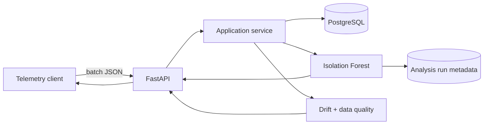

# GridWatch AI

[](https://github.com/PabloVA02/gridwatch-ai/actions/workflows/ci.yml)
[](https://www.python.org/)
[](https://fastapi.tiangolo.com/)
[](LICENSE)

API para ingerir telemetría energética y detectar comportamientos anómalos en equipos
industriales. El proyecto enseña un flujo completo: validación, persistencia, análisis de datos,
trazabilidad de ejecuciones, monitorización de drift y calidad, migraciones, pruebas y despliegue
reproducible.

> Portfolio project: the objective is to demonstrate backend and applied machine-learning
> engineering with reproducible decisions, not to present the model as a certified industrial
> diagnostic system.

## What it demonstrates

- Typed REST API with **FastAPI**, Pydantic and generated OpenAPI documentation.
- Time-series storage in **PostgreSQL** through SQLAlchemy 2 and Alembic migrations.
- Deterministic anomaly detection with **scikit-learn Isolation Forest**.
- Features for consumption, voltage, temperature, sudden changes and hour-of-day seasonality.
- Human-readable reason attached to every anomaly.
- Auditable analysis runs with detector and feature-schema versions plus a SHA-256 data fingerprint.
- PSI distribution-drift monitoring with explicit reference/current windows and per-feature status.
- Slot-based time-series quality: actual temporal coverage, boundary/internal gaps and maximum gap.
- Timezone-aware input contracts with equivalent instants normalized to UTC before persistence.
- Conflict handling for duplicate readings and minimum-data validation.
- Unit and end-to-end API tests, linting, coverage and GitHub Actions CI.
- Non-root Docker image and one-command local environment.

## Architecture



The detailed trade-offs and production roadmap are in
[`docs/architecture.md`](docs/architecture.md).

## Run locally

### Fastest option: SQLite

```bash
python -m venv .venv
source .venv/bin/activate
python -m pip install -e ".[dev]"
uvicorn app.main:app --reload
```

Open [http://localhost:8000/docs](http://localhost:8000/docs). No external database is needed for
this mode.

### Production-like option: Docker

```bash
docker compose up --build
```

This starts the API and PostgreSQL 18, runs the versioned migration and exposes the same Swagger UI.

## Try the complete flow

Generate a realistic 72-hour payload with two injected incidents:

```bash
python scripts/generate_demo_payload.py > /tmp/gridwatch-payload.json
curl -X POST http://localhost:8000/api/v1/readings/batch \
  -H 'Content-Type: application/json' \
  --data-binary @/tmp/gridwatch-payload.json
```

Run the analysis:

```bash
curl -X POST http://localhost:8000/api/v1/analysis/anomalies \
  -H 'Content-Type: application/json' \
  -d '{"device_id":"factory-line-a","contamination":0.08}'
```

Example response (shortened):

```json
{
  "device_id": "factory-line-a",
  "sample_size": 72,
  "anomalies_found": 5,
  "run": {
    "run_id": "23f...",
    "detector_version": "1.1.0",
    "detector_parameters": {"n_estimators": 250, "random_state": 42, "contamination": 0.08},
    "feature_schema_version": "energy-telemetry-v1",
    "dataset_fingerprint": "d86..."
  },
  "anomalies": [
    {
      "reading": {"energy_kwh": 146.328, "temperature_c": 52.93},
      "anomaly_score": 0.197122,
      "reason": "Unusual energy consumption compared with this device's selected time window."
    }
  ]
}
```

The exact result is deterministic for the same payload and contamination value. The explanation
describes correlation with the selected window; it does not claim to identify the physical cause.

Every analysis writes a small audit record. Repeating the same request over the same stored data
creates a new `run_id` but the same `dataset_fingerprint`, making the input and configuration
identity verifiable without duplicating the telemetry.

## Monitor drift and data quality

PSI needs enough observations to separate sampling noise from a distribution change. Generate a
separate 28-day device with 336 hourly observations in each window and a controlled shift in the
second half:

```bash
python scripts/generate_demo_payload.py \
  --points 672 \
  --shift-after 336 \
  --device-id factory-line-monitor > /tmp/gridwatch-monitoring.json
curl -X POST http://localhost:8000/api/v1/readings/batch \
  -H 'Content-Type: application/json' \
  --data-binary @/tmp/gridwatch-monitoring.json
```

Compare the two non-overlapping 14-day windows:

```bash
curl -X POST http://localhost:8000/api/v1/monitoring/drift \
  -H 'Content-Type: application/json' \
  -d '{
    "device_id":"factory-line-monitor",
    "reference_start_at":"2026-07-01T00:00:00Z",
    "reference_end_at":"2026-07-15T00:00:00Z",
    "current_start_at":"2026-07-15T00:00:00Z",
    "current_end_at":"2026-07-29T00:00:00Z",
    "expected_interval_minutes":60
  }'
```

The endpoint calculates Population Stability Index (PSI) from reference-derived buckets for
energy, voltage, temperature and absolute energy change. It reports `stable` below `0.10`,
`warning` from `0.10`, and `drift` from `0.25`. Each window requires at least **300 readings** and
bucket proportions use a `0.5` pseudocount to avoid extreme scores from empty finite-sample bins.
A seeded 2,000-pair same-distribution check at `n=300` produced approximately a `0.4%` warning rate
and no drift alerts; the automated regression test fails above a 5% warning rate. This validates
the chosen minimum against one controlled distribution, not every production process, so
thresholds still need device- and season-specific calibration.

Quality is measured by occupied expected-time slots, not raw row count. The response exposes
leading, internal and trailing missing intervals plus the largest gap including window boundaries;
therefore 24 readings concentrated in the first
hour of a 24-hour window report only `1/24` coverage. Quality is separate because missing or bursty
input can imitate drift.

All API timestamps must include a timezone offset. They are normalized to UTC before database
constraints run, so `2026-07-01T00:00:00Z` and `2026-07-01T02:00:00+02:00` are the same instant and
cannot bypass duplicate protection.

## API surface

| Method | Route | Purpose |
|---|---|---|
| `GET` | `/health` | Database-backed health check |
| `POST` | `/api/v1/readings/batch` | Validate and store up to 5,000 readings |
| `GET` | `/api/v1/readings` | Filter and inspect telemetry |
| `POST` | `/api/v1/analysis/anomalies` | Train on a selected window and rank anomalies |
| `GET` | `/api/v1/analysis/runs/{run_id}` | Retrieve detector/data trace metadata |
| `POST` | `/api/v1/monitoring/drift` | Compare drift and data quality across two windows |
| `GET` | `/api/v1/dashboard/devices` | Aggregate operational summary per device |

## Quality checks

```bash
ruff check .
ruff format --check .
pytest --cov=app --cov-report=term-missing --cov-fail-under=90
```

CI runs both commands for every push to `main` and every pull request; coverage below 90% fails the
build.

## Responsible limitations

- Isolation Forest is unsupervised: an anomaly is unusual, not necessarily faulty.
- The `contamination` parameter is an expected proportion and must be calibrated with domain data.
- Explanations are statistical hints; a technician should validate operational causes.
- PSI detects distribution change, not its cause or whether the change is harmful.
- The 300-reading floor and seeded simulation reduce one known source of PSI noise but do not
  replace calibration on representative historical data.
- The lightweight run registry stores reproducibility metadata, not serialized model artefacts.
- A production system should add labelled review outcomes, access control, alert routing and a full
  model registry when models are trained offline and promoted between environments.

## Author

**Pablo Verdejo Alonso** — Computer Engineering graduate candidate, Universidad Pontificia de
Salamanca (expected January 2027).

- [LinkedIn](https://www.linkedin.com/in/pablo-verdejo-alonso-7b9427371)
- [GitHub](https://github.com/PabloVA02)

This portfolio project was developed with AI-assisted tooling and reviewed through automated tests,
manual execution and documented engineering decisions. I can explain the architecture, model
limitations and implementation trade-offs described above.
