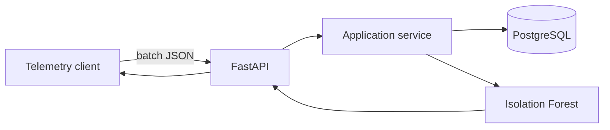

# GridWatch AI

[](https://github.com/PabloVA02/gridwatch-ai/actions/workflows/ci.yml)
[](https://www.python.org/)
[](https://fastapi.tiangolo.com/)
[](LICENSE)

API para ingerir telemetría energética y detectar comportamientos anómalos en equipos
industriales. El proyecto enseña un flujo completo: validación, persistencia, análisis de datos,
explicaciones operativas, migraciones, pruebas y despliegue reproducible.

> Portfolio project: the objective is to demonstrate backend and applied machine-learning
> engineering with reproducible decisions, not to present the model as a certified industrial
> diagnostic system.

## What it demonstrates

- Typed REST API with **FastAPI**, Pydantic and generated OpenAPI documentation.
- Time-series storage in **PostgreSQL** through SQLAlchemy 2 and Alembic migrations.
- Deterministic anomaly detection with **scikit-learn Isolation Forest**.
- Features for consumption, voltage, temperature, sudden changes and hour-of-day seasonality.
- Human-readable reason attached to every anomaly.
- Conflict handling for duplicate readings and minimum-data validation.
- Unit and end-to-end API tests, linting, coverage and GitHub Actions CI.
- Non-root Docker image and one-command local environment.

## Architecture



The detailed trade-offs and production roadmap are in
[`docs/architecture.md`](docs/architecture.md).

## Run locally

### Fastest option: SQLite

```bash
python -m venv .venv
source .venv/bin/activate
python -m pip install -e ".[dev]"
uvicorn app.main:app --reload
```

Open [http://localhost:8000/docs](http://localhost:8000/docs). No external database is needed for
this mode.

### Production-like option: Docker

```bash
docker compose up --build
```

This starts the API and PostgreSQL 18, runs the versioned migration and exposes the same Swagger UI.

## Try the complete flow

Generate a realistic 72-hour payload with two injected incidents:

```bash
python scripts/generate_demo_payload.py > /tmp/gridwatch-payload.json
curl -X POST http://localhost:8000/api/v1/readings/batch \
  -H 'Content-Type: application/json' \
  --data-binary @/tmp/gridwatch-payload.json
```

Run the analysis:

```bash
curl -X POST http://localhost:8000/api/v1/analysis/anomalies \
  -H 'Content-Type: application/json' \
  -d '{"device_id":"factory-line-a","contamination":0.08}'
```

Example response (shortened):

```json
{
  "device_id": "factory-line-a",
  "sample_size": 72,
  "anomalies_found": 5,
  "anomalies": [
    {
      "reading": {"energy_kwh": 146.328, "temperature_c": 52.93},
      "anomaly_score": 0.197122,
      "reason": "Unusual energy consumption compared with this device's selected time window."
    }
  ]
}
```

The exact result is deterministic for the same payload and contamination value. The explanation
describes correlation with the selected window; it does not claim to identify the physical cause.

## API surface

| Method | Route | Purpose |
|---|---|---|
| `GET` | `/health` | Database-backed health check |
| `POST` | `/api/v1/readings/batch` | Validate and store up to 5,000 readings |
| `GET` | `/api/v1/readings` | Filter and inspect telemetry |
| `POST` | `/api/v1/analysis/anomalies` | Train on a selected window and rank anomalies |
| `GET` | `/api/v1/dashboard/devices` | Aggregate operational summary per device |

## Quality checks

```bash
ruff check .
pytest --cov=app --cov-report=term-missing
```

CI runs both commands for every push to `main` and every pull request.

## Responsible limitations

- Isolation Forest is unsupervised: an anomaly is unusual, not necessarily faulty.
- The `contamination` parameter is an expected proportion and must be calibrated with domain data.
- Explanations are statistical hints; a technician should validate operational causes.
- A production system should track drift, labelled review outcomes and model versions.

## Author

**Pablo Verdejo Alonso** — Computer Engineering graduate candidate, Universidad Pontificia de
Salamanca (expected January 2027).

- [LinkedIn](https://www.linkedin.com/in/pablo-verdejo-alonso-7b9427371)
- [GitHub](https://github.com/PabloVA02)

This portfolio project was developed with AI-assisted tooling and reviewed through automated tests,
manual execution and documented engineering decisions. I can explain the architecture, model
limitations and implementation trade-offs described above.
