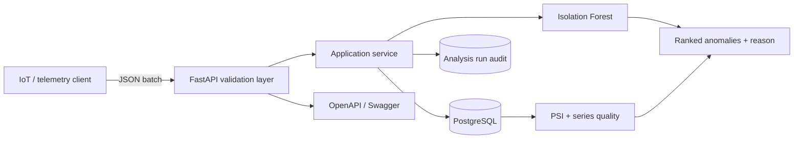

# Architecture and engineering decisions

## Why these choices

- **Batch ingestion** reduces network overhead while a unique database constraint makes
  repeated device/timestamp events safe to detect.
- **PostgreSQL in production, SQLite locally** keeps onboarding fast without changing the
  repository pattern or API contract.
- **Isolation Forest** is appropriate when labelled incidents are unavailable. A fixed random
  seed makes tests and demos reproducible.
- **Feature engineering** combines consumption, voltage, temperature, sudden consumption change
  and cyclical hour-of-day signals.
- **Explanations** identify the most statistically unusual measured feature. They are operational
  hints, not causal diagnoses.
- **Reproducibility metadata** gives every analysis a unique run identifier and stores detector
  version, feature-schema version, parameters, sample size and anomaly count. A SHA-256 digest over
  the canonical ordered readings and detector configuration identifies repeat inputs without
  copying the full dataset into the audit table.
- **PSI monitoring** uses five reference-derived quantile buckets and a `0.5` pseudocount to compare
  energy, voltage, temperature and absolute energy-change distributions. Each half-open window
  requires at least 300 readings; status thresholds are `0.10` for warning and `0.25` for drift. A
  seeded 2,000-pair `N(0,1)` check at that floor yielded approximately a `0.4%` false-warning rate
  and no drift alerts, versus an unusably noisy result at 12/24 observations. This is a regression
  guard for finite-sample noise, not proof that the defaults fit every device or seasonal pattern.
- **Series quality** maps each reading to an expected slot within `[start, end)`. Completeness is
  occupied slots divided by expected slots, so bursts cannot masquerade as full temporal coverage.
  Leading, internal and trailing missing intervals plus the maximum gap including window boundaries
  help distinguish data-pipeline loss from a genuine behavioural shift.
- **UTC normalization** rejects naive datetimes at the API boundary and converts aware datetimes to
  UTC before persistence. A SQLAlchemy type restores UTC awareness when SQLite returns naive values,
  preserving the same contract in local tests and PostgreSQL deployments.
- **Alembic migrations** version the schema; application startup also creates missing tables to
  keep the zero-configuration SQLite demo simple.

## Production follow-ups

For a high-volume deployment, telemetry ingestion would move behind a queue, readings would use
time-based partitioning, trained model artefacts would live in a registry, and observability would
include request latency, ingestion lag, alert routing and labelled anomaly review outcomes. The
current audit table is intentionally a lightweight trace, not a replacement for MLflow or another
model registry when a team starts promoting reusable trained artefacts.
