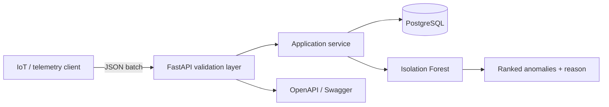

# Architecture and engineering decisions

## Why these choices

- **Batch ingestion** reduces network overhead while a unique database constraint makes
  repeated device/timestamp events safe to detect.
- **PostgreSQL in production, SQLite locally** keeps onboarding fast without changing the
  repository pattern or API contract.
- **Isolation Forest** is appropriate when labelled incidents are unavailable. A fixed random
  seed makes tests and demos reproducible.
- **Feature engineering** combines consumption, voltage, temperature, sudden consumption change
  and cyclical hour-of-day signals.
- **Explanations** identify the most statistically unusual measured feature. They are operational
  hints, not causal diagnoses.
- **Alembic migrations** version the schema; application startup also creates missing tables to
  keep the zero-configuration SQLite demo simple.

## Production follow-ups

For a high-volume deployment, telemetry ingestion would move behind a queue, readings would use
time-based partitioning, trained models would be versioned, and observability would include request
latency, ingestion lag, drift and anomaly review outcomes.
